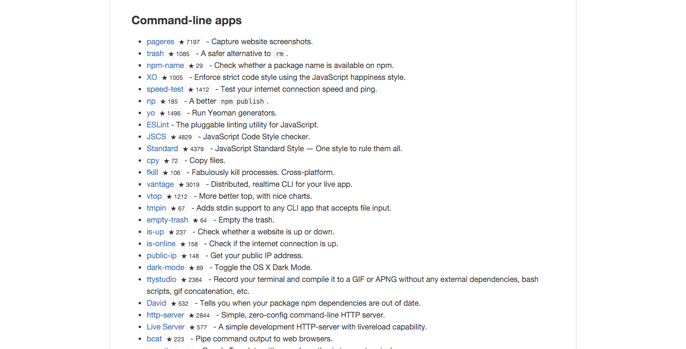
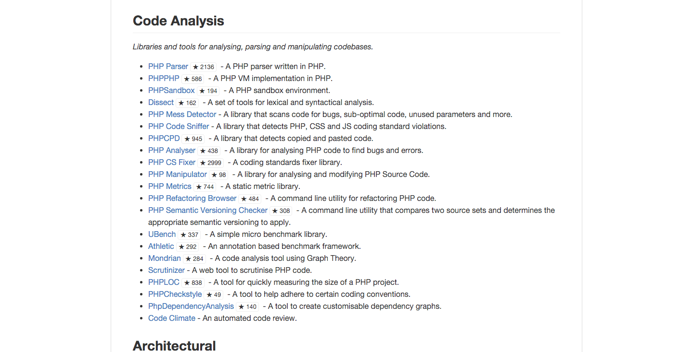
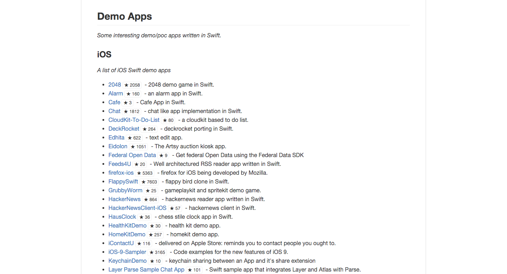

# Awesome stars

Peek stars of repository on awesome list.

## Installation

## Screenshots

### Node.js

[https://github.com/sindresorhus/awesome-nodejs](https://github.com/sindresorhus/awesome-nodejs)

### PHP

[https://github.com/ziadoz/awesome-php](https://github.com/ziadoz/awesome-php)

### Swift

[https://github.com/matteocrippa/awesome-swift](https://github.com/matteocrippa/awesome-swift)

## Todo

- [ ] Ensure cache works on GitHub API  
- [ ] Internalization

## License

MIT
