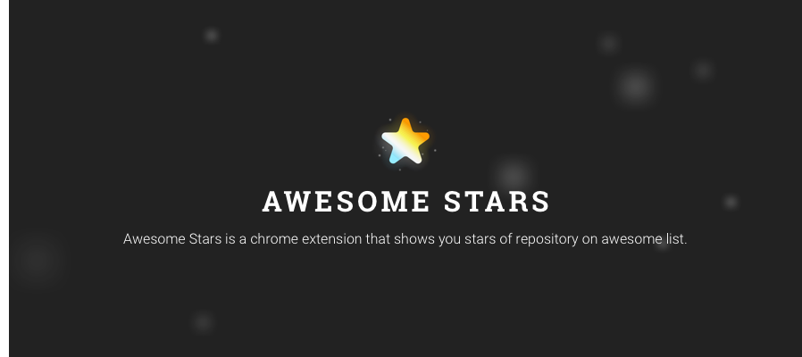

## Installation

## How to Use

1. [Create a access token](https://github.com/settings/tokens/new?description=Awesome%20Stars) at GitHub settings. **DO NOT select any scopes**!
    - For more information, checkout [GitHub documentation](https://help.github.com/articles/creating-a-personal-access-token-for-the-command-line/#creating-a-token).
2. Click Awesome Stars icon to open Options page. It locates near the icon to open Chrome menu.

3. Paste access token into the field, which has placeholder `Paste access token here`.

4. Click `Save`.
5. That's it!

## Changes from 1.x to 2.x

- Most importantly, use `chrome.local` instead of `chrome.sync` to store access token, so if you upgrade from 1.x, I strongly suggest you regenerate the access token for this extension.
- Check whether repository is listed on [awesome](https://awesome.re/) repository.
- Staring repositories in different colors is built-in now.
- Redesign UI, thanks to [@sandokaishy](https://github.com/sandokaishy).
- Recreate the project with [generator-chrome-extension-kickstart](https://github.com/HaNdTriX/generator-chrome-extension-kickstart) for Webpack 2 and Babel 6.

## Thanks to Contributors

> sorted in alphabetical order

- Peter [@sandokaishy](https://github.com/sandokaishy)
- Peter Dave Hello [@PeterDaveHello](https://github.com/PeterDaveHello)
- Tonypai [@tpai](https://github.com/tpai)

## How to Contribute

Please checkout [contribute documentation](CONTRIBUTE.md).

## License

MIT
