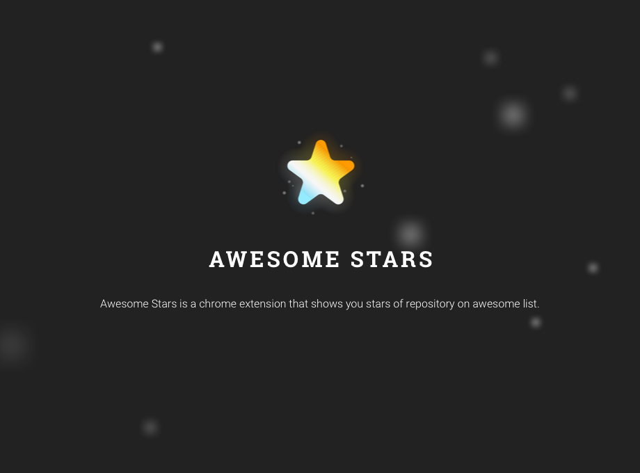
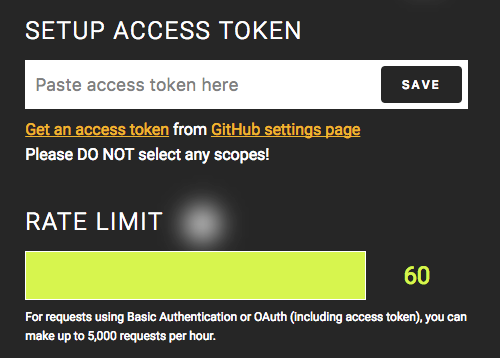
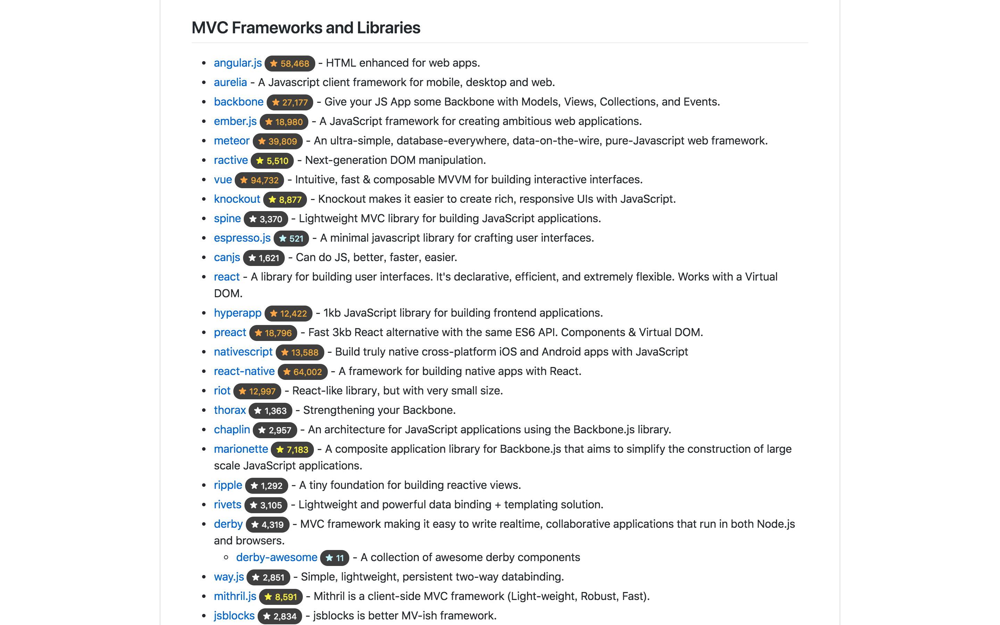
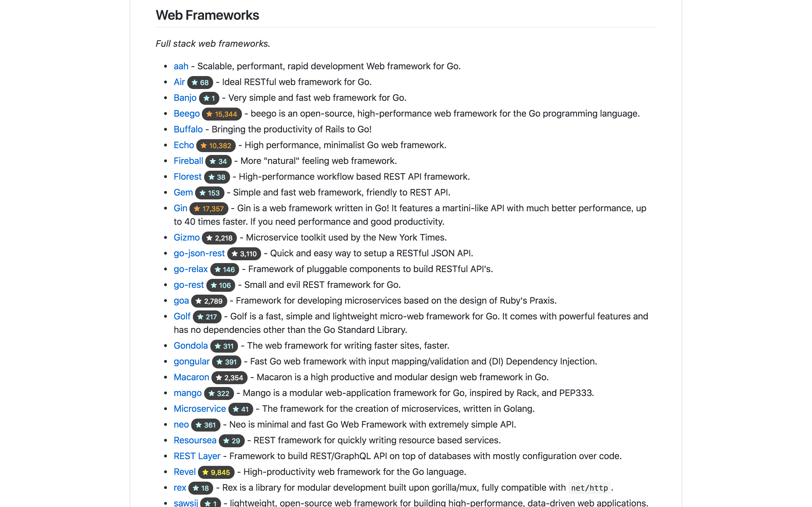

# Installation

# How to Use

1. [Create a access token](https://github.com/settings/tokens/new?description=Awesome%20Stars) at GitHub settings. **DO NOT select any scopes**!
   * For more information, checkout [GitHub documentation](https://help.github.com/articles/creating-a-personal-access-token-for-the-command-line/#creating-a-token).
1. Right click Awesome Stars icon to open menu, then click <kbd>Options</kbd> / <kbd>選項</kbd>.

   

1. Paste access token into the field, which has placeholder `Paste access token here` / `在這裡輸入 access token`.

   

1. Click <kbd>Save</kbd>.

1. That's it!

# Screenshots

## [sorrycc/awesome-javascript](https://github.com/sorrycc/awesome-javascript)

## [sindresorhus/awesome-nodejs](https://github.com/sindresorhus/awesome-nodejs)

## [ziadoz/awesome-php](https://github.com/ziadoz/awesome-php)

## [matteocrippa/awesome-swift](https://github.com/matteocrippa/awesome-swift)

##[avelino/awesome-go](https://github.com/avelino/awesome-go)

# Thanks to Contributors

> sorted in alphabetical order

* Peter [@sandokaishy](https://github.com/sandokaishy)
* Peter Dave Hello [@PeterDaveHello](https://github.com/PeterDaveHello)
* Tonypai [@tpai](https://github.com/tpai)

# How to Contribute

Please checkout [contribute documentation](CONTRIBUTE.md).

# License

MIT
