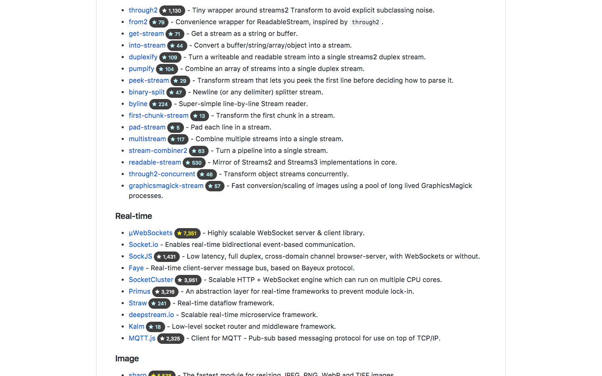
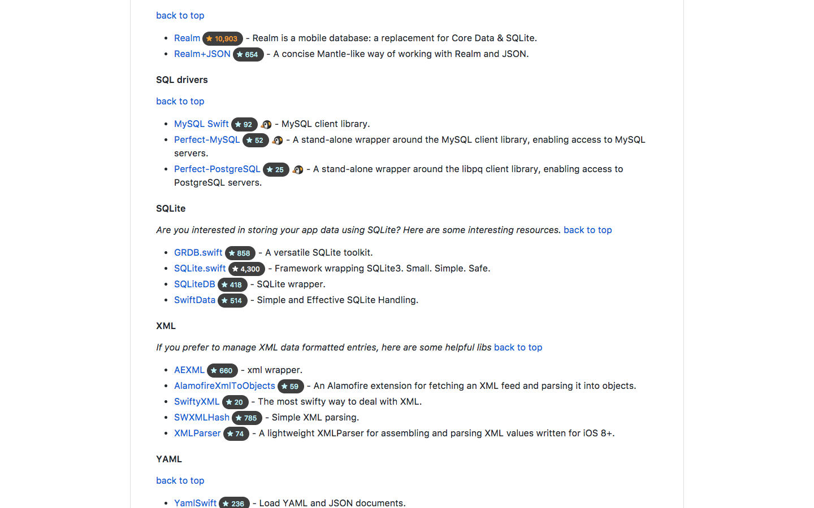

    

## Installation

## How to Use

1. [Create a access token](https://github.com/settings/tokens/new?description=Awesome%20Stars) at GitHub settings. **DO NOT select any scopes**!
    - For more information, checkout [GitHub documentation](https://help.github.com/articles/creating-a-personal-access-token-for-the-command-line/#creating-a-token).
2. Click Awesome Stars icon to open Options page. It locates near the icon to open Chrome menu.

3. Paste access token into the field, which has placeholder `Paste access token here`.

4. Click `Save`.
5. That's it!

## Screenshots

### Awesome Node.js

### Awesome PHP

### Awesome Swift

## Thanks to Contributors

> sorted in alphabetical order

- Peter [@sandokaishy](https://github.com/sandokaishy)
- Peter Dave Hello [@PeterDaveHello](https://github.com/PeterDaveHello)
- Tonypai [@tpai](https://github.com/tpai)

## How to Contribute

Please checkout [contribute documentation](CONTRIBUTE.md).

## License

MIT
