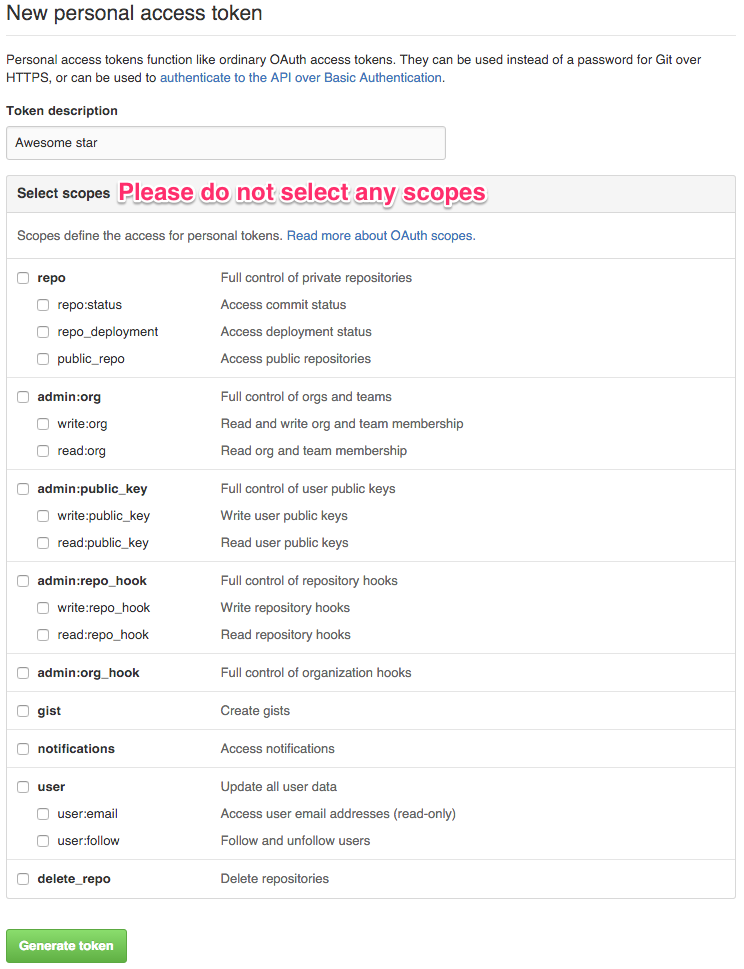
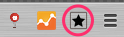
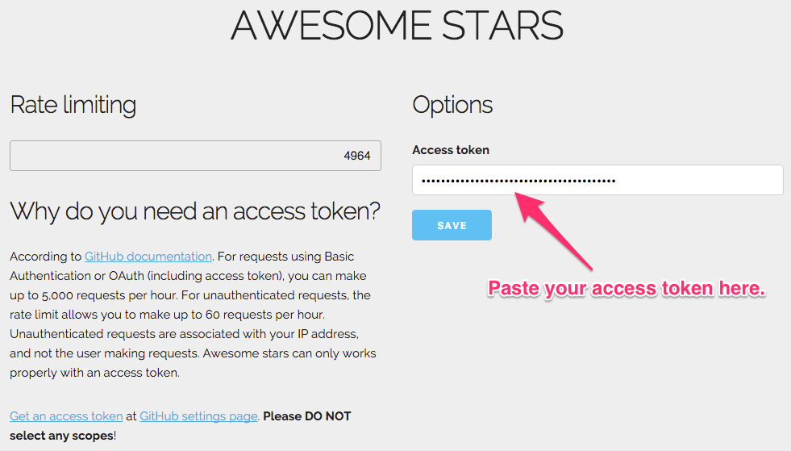

# HOW TO USE

## Install from Chrome Web Store

## Get an access token

Due to [GitHub API rate limiting](https://developer.github.com/v3/#rate-limiting), you [need an access token](https://github.com/settings/tokens/new?description=Awesome%20star) to let the extension properly works.

The extension does not need any scopes. **Please do not select any scopes** to keep your account safe.

## Set access token

Click Awesome star icon to open options page.

Paste your access token in the field and press `Save`.

That's all. 

